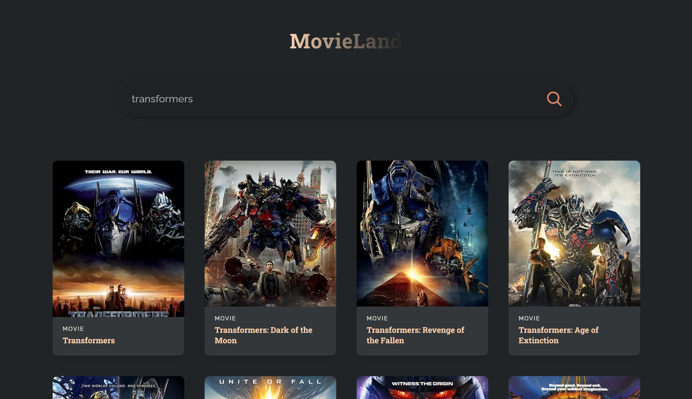

# Movie Search App

A React application to search for movies using the OMDB API.

## Features
- **Search functionality**: Enter a movie title in the search bar to find relevant movies.
- **Movie details**: Displays movie titles, release years, and posters.
- **Responsive design**: Optimized for various screen sizes.

## Technologies Used
- React.js
- Fetch API (native browser implementation)
- CSS for styling

## Installation

1. **Clone the repository**:
git clone https://github.com/yourusername/movie-search-app.git

text

2. **Navigate to the project directory**:
cd movie-search-app

text

3. **Install dependencies**:
npm install

text

4. **Set up environment variables**:
- Create a `.env` file in the root directory.
- Add your OMDB API key:
  ```
  REACT_APP_OMDB_API_KEY=your_api_key_here
  ```

5. **Start the development server**:
npm start

text

## Usage

1. Open the app in your browser after starting the development server.
2. Enter a movie title in the search bar.
3. Press Enter or click the search button.
4. View the search results with movie posters, titles, and release years.

## Screenshot

  

## How to Get an OMDB API Key

1. Visit [OMDb API](https://www.omdbapi.com/).
2. Click "API Key" and sign up for a free account.
3. Confirm your email address and retrieve your API key from the dashboard.
4. Add this key to your `.env` file as `REACT_APP_OMDB_API_KEY`.

## Contributing

Contributions are welcome! To contribute:
1. Fork this repository.
2. Create a feature branch (`git checkout -b feature-name`).
3. Commit your changes (`git commit -m "Add feature"`).
4. Push to the branch (`git push origin feature-name`).
5. Submit a pull request.
